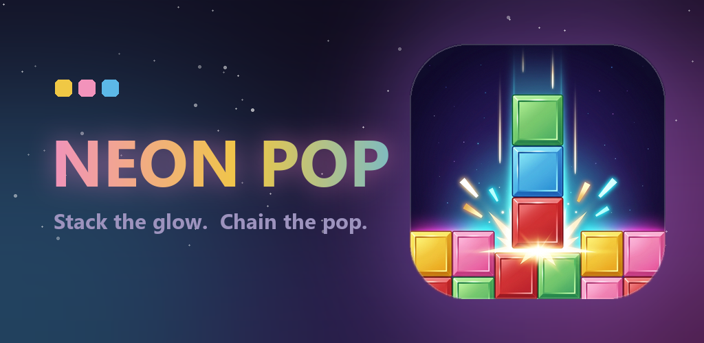

  

<h3 align="center">Match three of a colour. Then get out of the way.</h3>

  <a href="https://wish-go.github.io/neon-pop/"><b>wish-go.github.io/neon-pop</b></a>

---

A trio of coloured blocks falls. Slide it, spin the colours, drop it. Get three of the
same colour in a line — across, down or diagonally — and they pop. Whatever was stacked
on top falls into the hole, and if *that* lands in a match, it keeps going.

Long chains are where the score is.

**ARCADE** is a clean run: just you and the stack.
**FLOW** hands you a bomb, a paint brush and a few other things, plus one second chance.

Coming to Google Play.

### Links

- [Privacy Policy](https://wish-go.github.io/neonpop-legal/privacy.html)
- [Terms of Service](https://wish-go.github.io/neonpop-legal/terms.html)
- Something broken or unfair? <aslm2l1k123@gmail.com>

